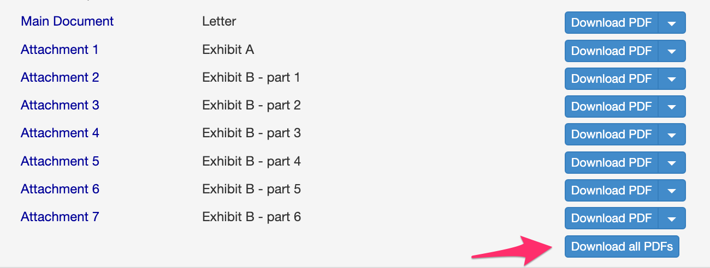
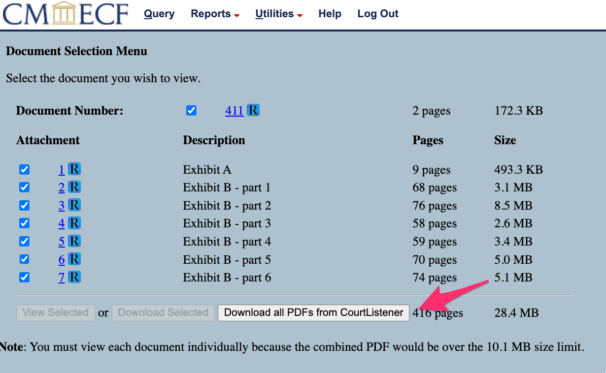

# courtlistener-download

Chrome extension to download all files related to one docket entry on CourtListener.

On CourtListener docket pages, where there are multiple PDF documents attached to one entry and available on CourtListener, the extension adds a button to download all PDFs attached to that entry. They will be downloaded as a .zip file, and renamed to match the human-readable filenames instead of CourtListener's style.

If you have the [RECAP extension](https://free.law/recap) installed (and you should!!), this extension will also work on PACER:

## Install

1. Download this repo as a .zip file from GitHub.
2. Unzip the file.
3. Go to the extensions page at `chrome://extensions`.
4. Enable Developer Mode using the toggle button at the top right.
5. Drag the `courtlistener-download` folder anywhere on the page to import it. (Do not delete the folder afterwards).

[Chrome tutorial on running unpacked extensions](https://developer.chrome.com/docs/extensions/get-started/tutorial/hello-world#load-unpacked)
